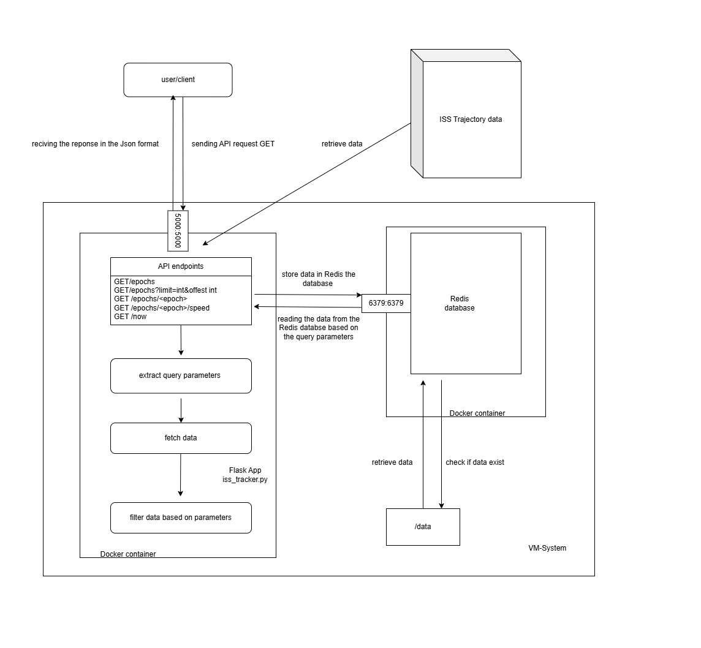

## Project Overview

The project utilize a modern technology stack to efficetly retrieve, store
and serve ISS trajectory data. At its core, the Flask web framework is used to develop a RESTful API, allowing users to query ISS state vector data through various endpoints. And to optimize performance, the project employs Redis, and in memory key
This project provides a RESTful API to retrieve and process the International Space Station (ISS) trajectory data from NASA’s public dataset. The API enables users to access the latest position, velocity, and trajectory data of the ISS, compute its instantaneous and average speed, and determine its geographical location over the Earth in real time.

To ensure efficient data retrieval and storage, the project uses Redis, a high-performance, in-memory database that allows for quick access to ISS state vectors. This setup minimizes latency and optimizes API performance.

Additionally, the tool is containerized using Docker, making deployment seamless, portable, and scalable across different environments.


## File Descriptions
- [Dockerfile](Dockerfile) Dockerfile to generate docker image of our application
- [requirements.txt](requirements.txt) Required dependencies for the project
- [iss_tracker.py](iss_tracker.py) Script to process the ISS dataset& Flask application
- [test_iss_tracker.py](test_iss_tracker.py) Unit tests for ISS data processing
- [docker-compose.yml](docker-compose.yml) It is responsible for orchestrating multiple containers required for running the ISS tracking API. 


## Software Diagram


Software diagram of the Flask Application. Visualization of the application workflow using Docker and how to API endpoints interact between the code and web server.

## Dataset information

This project utilizes the ISS Trajectory Data from NASA, which contains positional and velocity state vectors of the International Space Station (ISS). The data is provided in XML format and includes timestamps (EPOCH), Cartesian coordinates (X, Y, Z), and velocity components (X_DOT, Y_DOT, Z_DOT) in kilometers and kilometers per second. 

### Accessing the dataset 


To access the dataset, using the link https://spotthestation.nasa.gov/trajectory_data.cfm, the data is fected dynamically in the script.


### Data Format
The XML file consists of multiple <stateVector> elements, each representing a recorded timestamp (EPOCH) along with:

Position vectors (X, Y, Z) in km
Velocity vectors (X_DOT, Y_DOT, Z_DOT) in km/s

Example of a single entry in the XML file

```xml
<stateVector>
    <EPOCH>2025-04T12:00:00.000Z</EPOCH>
    <X units="km">-1636.12</X>
    <Y units="km">4106.75</Y>
    <Z units="km">-5162.71</Z>
    <X_DOT units="km/s">-7.42</X_DOT>
    <Y_DOT units="km/s">-1.09</Y_DOT>
    <Z_DOT units="km/s">-1.48</Z_DOT>
</stateVector>
```

## Content


- **`Dockerfile`**

    - The Dockerfile defines the containerized environment for running the python scripts. It:
        - Uses Python 3.9 as the base image
        - Sets up the working directory inside the container
        - Copies all Python scripts into the container
        - Installs necessary dependencies (e.g., pytest for unit testing)
        - Specifies python3 as the default command


- **`iss_tracker.py`**
  - read the ISS trajectory data from the NASA website
  - function to compute summary statistics including 
    - average speed of the ISS 
    - latest ISS data
    - range of ISS data 
    - geolocation of ISS
    - longitude, latitude, and altitude of the ISS
  


- **`test_iss_tracker.py`**

  - unit test for `iss_tracker.py`
    - verify the accuracy of the result


- **`docker-compose.yml`**
  - The docker-compose.yml file defines the multi-container setup for the ISS Tracker application. It specifies the services required for the application, including:
    - A Flask-based web server to provide API endpoints
    - A Redis database for storing ISS state vectors and efficiently reetrieving them 

  - Also, to ensure that Redis data persists across container restarts, we use a bind mount to store the database backup locally in the `./data/`directory. On startup, Redis loads the existing data from `./data/` if available. If it is empty, Flask fecthes the ISS trajectory data from NASA stores it in Redis. And Redis periodcally saves its dataset to `./data/` ensuring persistence. 


## **Run the Project**


**1. Ensure Docker & Docker Compose are installed**

**2. Create a data/ Directory in your Local Machine**

Before running the continer, create a persistent directory on your host machine to store Redis data 
```bash
mkdir -p data
```


**3. Run the Containerized Data Analysis**

run the following command to start your Flask and Redis containers
```bash
docker-compose up
```
This will:
- build and start the services defined in your docker-compose.yml file
- if it is the first time running, it will pull images, build the Flask ap, and start the container.

if you want to run it in the background, use:
```bash
docker-compose up -d
```

**4. Check Running Containers**

To verify that containers is running using the command:
```bash
docker ps
```
you should see both Flask app and Redis containers listed

**5. Test API endpoint**

After verifying that the containers are running, use curl to access different API endpoints and retrieve ISS data.

**6. Stop the Containers**

If you want to stop the containers, using the command:
```bash
docker-compose down
```


## API Endpoints & curl Commands

This flask web application provides real-time access to the ISS state vectors using data from NASA's website 

The API allows users to retrieve all available EPOCHs. Below are the API endpoints along with their descriptions and sample curl requests. 


## **`curl`** request 

Below are the API endpoints along with their descriptions are sampele curl requests. 

**1. Get All EPOCHS**

Return entire dataset 
```bash
curl -X GET "http://127.0.0.1:5000/epochs"
```


**2. Get EPOCHs with Paginations**

Return modified list of Epochs given query parameters
```bash
curl -X GET "http://127.0.0.1:5000/epochs?limit=2&offset=1"
```
Example output
```bash
[{"EPOCH":"2025-069T12:00:00.000Z","X":{"#text":"-3219.37463979321","@units":"km"},"X_DOT":{"#text":"3.3945740789154901","@units":"km/s"},"Y":{"#text":"-5571.6394580318401","@units":"km"},"Y_DOT":{"#text":"-4.12924891352844","@units":"km/s"},"Z":{"#text":"2188.9689315964902","@units":"km"},"Z_DOT":{"#text":"-5.4857064366860397","@units":"km/s"}},{"EPOCH":"2025-069T12:04:00.000Z","X":{"#text":"-2297.5248516224701","@units":"km"},"X_DOT":{"#text":"4.24056803838024","@units":"km/s"},"Y":{"#text":"-6348.0542884608103","@units":"km"},"Y_DOT":{"#text":"-2.3014912634682498","@units":"km/s"},"Z":{"#text":"808.627939779857","@units":"km"},"Z_DOT":{"#text":"-5.94669715389632","@units":"km/s"}}]
```

**3. Get EPOCHs with specific time**

Return state vectors for a specific Epoch from the data set
```bash
curl -X GET "http://127.0.0.1:5000/epochs/2025-071T12:00:00.000Z"
```
Example output

```bash
{"EPOCH":"2025-071T12:00:00.000Z","X":{"#text":"-3831.5417244867499","@units":"km"},"X_DOT":{"#text":"3.1540308387542102","@units":"km/s"},"Y":{"#text":"-5378.0078215633202","@units":"km"},"Y_DOT":{"#text":"-3.98049384870232","@units":"km/s"},"Z":{"#text":"1613.89699191451","@units":"km"},"Z_DOT":{"#text":"-5.7331860354583801","@units":"km/s"}}
```

**4. Get instantaneous speed at a specific EPOCH**

Get the speed of ISS at specific EPOCH 
```bash
curl -X GET "http://127.0.0.1:5000/epochs/2025-051T12:00:00.000Z/speed"
```
Example output


**5. Get Closest Data to Current time**

Return instantaneous speed, latitude, longitude, altitude and geoposition for the Epoch that is the nearest time
```bash
curl -X GET "http://127.0.0.1:5000/now"
```
Example output
```bash
{"altitude_km":419.6704641558508,"closest_epoch":"2025-071T19:04:00.000Z","geo_location":"Over the ocean","latitude":4.837319598958323,"longitude":-18.98304788519664,"speed_km_s":7.667519550012788}
```


**6. Get the geo information at a specific EPOCH** 

Return latitude, longtiude, alrituded and geoposition for a specific Epoch in the data set
```bash
curl -X GET "http://127.0.0.1:5000/epochs/<epoch>/location"
```
Example output
```bash
{"altitude_km":419.16904054685074,"closest_epoch":"2025-071T18:00:00.000Z","geo_location":"Bawu, Changchun City, Jilin, 130000, China","latitude":43.77428890109301,"longitude":124.33843824759597,"speed_km_s":7.662912803714407}
```

## Run unit test

Ensure the Flask service is running
Use pytest to run all unit tests

```bash
$ pytest
```


## Using AI 

ChatGPT was used to assist in debugging this project. It was utilized to identify and resolve errors in the code, clarify issues related to data handling, and troubleshoot unexpected behavior in the application. All AI-assisted debugging was manually reviewed and tested to ensure accuracy and correctness.


